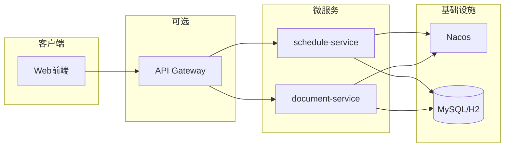

# 日程管理项目设计文档

## 0. 参考优秀项目与最佳实践

本设计参考以下业界实践，用于统一 API 风格、数据模型与体验：

| 来源 | 参考要点 |
|------|----------|
| **Cal.com API v2** | 认证（API Key / OAuth）、HTTPS 强制、限流（如 120 次/分钟）、日程与可用时段分离。 |
| **Nylas** | 时间槽与可用性计算、时区处理、会议时长与边界情况。 |
| **ScheduleMyDay / 日计划类产品** | 日程与任务区分（固定时间段 vs 跨天待办）、单日视图聚合（日程 + 笔记）、反思与历史追踪。 |
| **REST 最佳实践** | 统一错误响应（code、message、timestamp、校验详情）、列表分页（page、size、total）、Repository + Service 分层。 |

据此在本项目中落实：**统一 Result 错误结构**、**列表分页与 PageResult**、**时区约定**、**每日聚合接口**、**提醒字段**、**安全与限流预留**。

---

## 1. 引言

### 1.1 项目背景

本项目由「图书示例」微服务演进为「日程管理」项目，在现有技术栈（Java 17、Spring Boot、MyBatis-Plus、Nacos、book-common）基础上，新增每日日程登记与日常文档编辑管理能力，形成可落地的日程管理后端服务。

### 1.2 设计目标

- **每日日程登记**：支持日程事件的创建、编辑、删除与按时间范围查询；支持全天事件、颜色/分类；可选重复规则。
- **日常文档编辑管理**：按自然日维度的日记/笔记，支持标题、正文（纯文本/Markdown）；可与日程关联。
- **可扩展、与现有技术栈一致**：沿用 book-common 统一响应与异常、Nacos 注册、MyBatis-Plus 且 SQL 全部在 Mapper XML 中实现。

### 1.3 术语说明

| 术语 | 说明 |
|------|------|
| 日程 / 事件 (Schedule / Event) | 具有开始/结束时间的日程项，可重复，用于日历展示。 |
| 日常文档 (Daily Document) | 按自然日维度的单篇文档，如日记、当日笔记。 |
| 日记 / 笔记 (Diary / Note) | 日常文档的别称，强调内容为文本/Markdown。 |

---

## 2. 功能需求

### 2.1 每日日程登记

- **日程事件 CRUD**：标题、描述、开始/结束时间、是否全天事件、颜色/分类。
- **日历视图支持**：按日、按周、按月查询与展示；接口提供按时间范围查询（`start`、`end`），具体视图由前端实现。
- **重复规则（可选）**：每日/每周/每月重复；重复结束条件（截止日期或重复次数）。
- **可选扩展**：提醒时间、与「某日文档」的关联。

### 2.2 日常文档编辑管理

- **按日维度**：每个自然日可对应一篇「每日文档」，支持创建、编辑、删除。
- **文档内容**：标题、正文（首版支持纯文本 + Markdown，富文本为可选扩展）；创建/修改时间。
- **与日程关联（可选）**：日程可关联到某日文档，或文档内引用日程 ID，便于「某日日程 + 某日笔记」一起查看。

### 2.3 通用与扩展

- **多用户（可选）**：首版可单用户或本地使用；预留 `user_id` 或 `tenant_id`，便于后续多租户/多用户与权限隔离。
- **统一规范**：所有接口使用 book-common 的 `Result<T>`、`ResultCode`、`BusinessException`；全局异常处理将异常转换为统一 Result。

---

## 3. 系统架构与模块划分

### 3.1 架构图



### 3.2 方案 A（推荐首版）：单服务内聚

- **服务名**：`schedule-service`（新建或由现有 book-service 重命名/改造）。
- **内容**：在同一服务内包含「日程」与「每日文档」两个业务模块，共享同一数据库与事务，便于快速迭代与关联查询。
- **依赖**：依赖 book-common；所有自定义 SQL 在各自 Mapper XML 中实现。

### 3.3 方案 B：双服务拆分

- **schedule-service**：仅负责日程事件 CRUD、按时间范围查询、重复规则。
- **document-service**：仅负责每日文档 CRUD、按日期查询；通过 Nacos 发现 schedule-service，使用 Feign 或 RestTemplate 调用（如需跨服务关联）。
- **适用**：后续规模扩大、需独立部署与独立扩展时采用。

### 3.4 与现有项目衔接

- 两服务（或单服务内两模块）均依赖 **book-common**（Result、ResultCode、BusinessException、CommonConstant）。
- 配置风格与现有 `application.yml` 一致（Nacos、MyBatis-Plus、mapper-locations）。
- 日志与注释规范与现有 BookController、BookService 一致（SLF4J + Logback，关键逻辑带注释与日志）。

---

## 4. 数据模型设计

### 4.1 日程事件表 `schedule_event`

| 字段 | 类型 | 说明 |
|------|------|------|
| id | BIGINT | 主键，自增 |
| user_id | BIGINT | 用户 ID（可选，首版可 NULL 或固定值） |
| title | VARCHAR(200) | 标题 |
| description | VARCHAR(2000) | 描述 |
| start_time | DATETIME | 开始时间 |
| end_time | DATETIME | 结束时间 |
| is_all_day | TINYINT | 是否全天事件：0-否，1-是 |
| color | VARCHAR(20) | 颜色/分类标识 |
| repeat_rule | VARCHAR(100) | 重复规则：NONE/DAILY/WEEKLY/MONTHLY |
| repeat_until | DATE | 重复截止日期（可为空） |
| reminder_minutes | INT | 提前提醒分钟数（如 15、30），NULL 表示不提醒 |
| created_at | DATETIME | 创建时间 |
| updated_at | DATETIME | 更新时间 |
| deleted | TINYINT | 逻辑删除：0-未删除，1-已删除 |

- **索引建议**：`(user_id, start_time)`、`(user_id, end_time)` 或联合索引 `(user_id, start_time, end_time)`，用于按时间范围查询。

### 4.2 每日文档表 `daily_document`

| 字段 | 类型 | 说明 |
|------|------|------|
| id | BIGINT | 主键，自增 |
| user_id | BIGINT | 用户 ID（可选） |
| doc_date | DATE | 文档日期（按用户唯一：同一 user_id 下 doc_date 唯一） |
| title | VARCHAR(200) | 标题 |
| content | TEXT | 正文 |
| content_type | VARCHAR(20) | 内容类型：plain / markdown |
| created_at | DATETIME | 创建时间 |
| updated_at | DATETIME | 更新时间 |
| deleted | TINYINT | 逻辑删除 |

- **唯一约束**：`(user_id, doc_date)`（若有多用户）；单用户时可仅对 `doc_date` 唯一。
- **索引建议**：`(user_id, doc_date)`。

### 4.3 关联表（可选）`event_document_ref`

| 字段 | 类型 | 说明 |
|------|------|------|
| id | BIGINT | 主键，自增 |
| event_id | BIGINT | 日程事件 ID |
| document_id | BIGINT | 每日文档 ID |
| created_at | DATETIME | 创建时间 |

- 用于「日程与某日文档」的多对多关联；首版可不实现，仅在文档中预留。

### 4.4 建表示例（MySQL）

```sql
CREATE TABLE schedule_event (
    id          BIGINT AUTO_INCREMENT PRIMARY KEY,
    user_id     BIGINT,
    title       VARCHAR(200) NOT NULL,
    description VARCHAR(2000),
    start_time  DATETIME NOT NULL,
    end_time    DATETIME NOT NULL,
    is_all_day  TINYINT DEFAULT 0,
    color       VARCHAR(20),
    repeat_rule VARCHAR(100) DEFAULT 'NONE',
    repeat_until DATE,
    reminder_minutes INT,
    created_at  DATETIME DEFAULT CURRENT_TIMESTAMP,
    updated_at  DATETIME DEFAULT CURRENT_TIMESTAMP ON UPDATE CURRENT_TIMESTAMP,
    deleted     TINYINT DEFAULT 0,
    INDEX idx_user_time (user_id, start_time, end_time)
);

CREATE TABLE daily_document (
    id          BIGINT AUTO_INCREMENT PRIMARY KEY,
    user_id     BIGINT,
    doc_date    DATE NOT NULL,
    title       VARCHAR(200),
    content     TEXT,
    content_type VARCHAR(20) DEFAULT 'plain',
    created_at  DATETIME DEFAULT CURRENT_TIMESTAMP,
    updated_at  DATETIME DEFAULT CURRENT_TIMESTAMP ON UPDATE CURRENT_TIMESTAMP,
    deleted     TINYINT DEFAULT 0,
    UNIQUE KEY uk_user_date (user_id, doc_date),
    INDEX idx_user_date (user_id, doc_date)
);
```

---

## 5. 接口设计（REST API）

### 5.1 统一约定

- 所有接口返回体为 `Result<T>`（见 book-common）；成功时 `code=0`，`data` 为业务数据；失败时由全局异常处理返回 `Result.fail(...)`，结构一致（code、message、data），便于前端统一处理。
- 请求体与响应体使用 JSON；日期时间格式：ISO 8601（如 `yyyy-MM-ddTHH:mm:ss`）或 `yyyy-MM-dd`；**时区**：首版按「服务器本地时区」存储与返回，后续可扩展为 UTC 存储 + 请求头带时区展示。
- **分页**：列表类接口支持 `page`、`size`，返回使用 `PageResult<T>`（list、total、page、size），避免单次数据过大。

### 5.2 日程接口

| 方法 | 路径 | 说明 |
|------|------|------|
| POST | /api/schedules | 创建日程；Body：title, description, startTime, endTime, isAllDay, color, repeatRule, repeatUntil, reminderMinutes |
| GET | /api/schedules/{id} | 根据 ID 查询 |
| GET | /api/schedules?start=&end=&view=&page=&size= | 按时间范围查询；start/end 为日期或日期时间；view 可选 day/week/month；page/size 分页（可选） |
| PUT | /api/schedules/{id} | 更新日程 |
| DELETE | /api/schedules/{id} | 删除（逻辑删除） |

**按范围查询示例**：`GET /api/schedules?start=2025-03-01&end=2025-03-31&view=month`  
返回该时间范围内、未逻辑删除的日程列表。

### 5.3 日常文档接口

| 方法 | 路径 | 说明 |
|------|------|------|
| POST | /api/daily-docs | 创建文档；Body：docDate, title, content, contentType |
| GET | /api/daily-docs/{date} | 按日期查询单篇文档；date 格式 yyyy-MM-dd |
| GET | /api/daily-docs?date= | 同上，使用查询参数 date=yyyy-MM-dd |
| GET | /api/daily-docs?from=&to=&page=&size= | 按日期区间列表，支持分页 |
| GET | /api/daily-view?date= | **每日聚合**：返回该日的日程列表 + 当日文档（若有），便于前端「一日一屏」展示 |
| PUT | /api/daily-docs/{id} | 更新文档 |
| DELETE | /api/daily-docs/{id} | 删除（逻辑删除） |

### 5.4 错误响应结构

与 book-common 一致，失败时返回形如：

```json
{
  "code": 400,
  "message": "请求参数错误",
  "data": null
}
```

校验失败可扩展为 `data` 中带字段级错误（如 `fieldErrors`），便于前端高亮表单项。

### 5.5 响应示例

**成功**：`Result.ok(data)`

```json
{
  "code": 0,
  "message": "成功",
  "data": {
    "id": 1,
    "title": "周会",
    "startTime": "2025-03-17 10:00:00",
    "endTime": "2025-03-17 11:00:00",
    "isAllDay": 0
  }
}
```

**每日聚合**：`GET /api/daily-view?date=2025-03-17` 返回 `{ "events": [...], "document": { ... } }`，document 可为 null。

**失败**：`Result.fail(code, message)`（如 404）

```json
{
  "code": 404,
  "message": "资源不存在",
  "data": null
}
```

---

## 6. 技术实现要点

- **语言与框架**：Java 17、Spring Boot 3.2.x、MyBatis-Plus；所有自定义 SQL 写在 Mapper XML，与现有 book-service 一致。
- **注册与配置**：Nacos 服务发现与注册；配置文件风格与现有 `application.yml`、`application-dev.yml`、`application-local.yml` 一致。
- **日志与注释**：SLF4J + Logback；Controller/Service 层关键入参、出参与异常打日志；公共接口与复杂逻辑补充 JavaDoc 或行内注释。
- **数据库**：首版可继续支持 H2 + schema 初始化（建表脚本放在 `resources/schema*.sql`）；生产使用 MySQL，使用上述建表脚本或等价 DDL。

---

## 7. 非功能与扩展

### 7.1 性能

- 时间范围查询依赖索引（如 `user_id + start_time/end_time`）；列表接口支持分页（page、size），返回 total 便于前端分页控件。
- 大量日程时避免单次拉取整月；推荐按周/按日分段或分页。

### 7.2 安全与限流

- **认证**：若后续支持多用户，采用认证（如 JWT）+ `user_id` 隔离；所有读写按 `user_id` 过滤。
- **HTTPS**：生产环境强制 HTTPS；敏感信息不放在 URL 或前端代码中。
- **限流**：可参考 Cal.com 等（如 120 次/分钟/客户端），在网关或应用层预留限流配置。

### 7.3 前端建议

- **日历视图**：日/周/月视图；时间轴展示事件；可选拖拽调整时间（对应后端 PUT 接口）。
- **文档编辑**：Markdown 编辑器（如 SimpleMDE、Vditor）；按日期切换文档与当日日程联动展示。

---

## 8. 实施阶段建议

| 阶段 | 内容 |
|------|------|
| 阶段 1 | 建表 + schedule-service（或统一服务）中「日程」CRUD + 按时间范围查询接口。 |
| 阶段 2 | 「每日文档」CRUD + 按日期/按区间查询接口。 |
| 阶段 3 | 重复规则解析与展示、日程与文档关联（可选）；多用户与权限（可选）。 |

---

## 附录：与现有代码的对应关系

- **统一响应与异常**：使用 book-common 的 `Result`、`ResultCode`、`BusinessException`；全局异常处理可参考 book-service 中的 `GlobalExceptionHandler`。
- **数据访问**：实体使用 MyBatis-Plus 注解（@TableName、@TableId、@TableLogic）；Mapper 接口继承 `BaseMapper<Entity>`，自定义方法在 XML 中实现。
- **配置与启动**：Nacos、MyBatis-Plus mapper-locations、数据源等与现有 book-service 保持一致；新服务或新模块在父 POM 的 modules 中声明并依赖 book-common。
